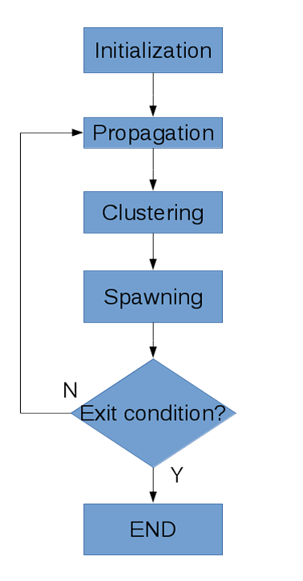

.. AdaptivePELE documentation master file, created by
   sphinx-quickstart on Wed Oct 19 14:28:26 2016.
   You can adapt this file completely to your liking, but it should at least
   contain the root `toctree` directive.

========================================
Welcome to AdaptivePELE's documentation!
========================================

AdaptivePELE is a Python module to perform enhancing sampling of molecular
simulation built around the Protein Energy Landscape Exploration method (`PELE <pele.bsc.es>`_). AdaptivePELE's 
code is publicly available in `GitHub <https://github.com/AdaptivePELE/AdaptivePELE>`_ under the MIT license.

Contents
========

.. toctree::
   :maxdepth: 2

   Examples
   Changelog
   AdaptivePELE

Indices and tables
==================

* :ref:`genindex`
* :ref:`modindex`
* :ref:`search`

